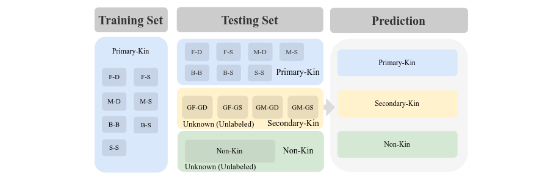
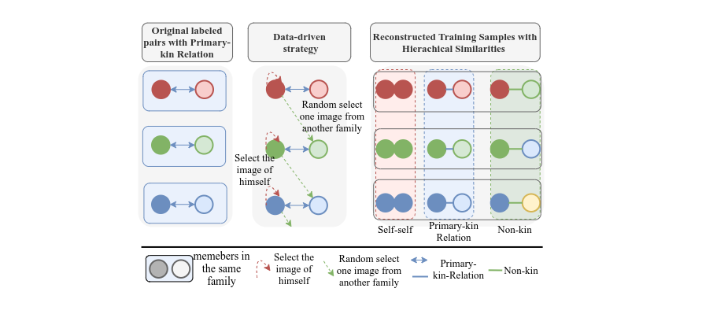
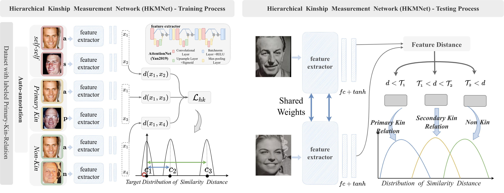

## Data Settings
> - The dataset can be downloaded at official [**website**](https://web.northeastern.edu/smilelab/fiw/download.html)  
> - The generated label can be found at `./datasets/`
<center>
 
</center>


## Methods
### Data-driven Strategy
The detailed pipeline of data-driven strategy is depicted in the following figure.
<center>
 
</center>

### Framework
<center>
 
</center>


## Train and Test
_**train:**_
```
python train_HK.py
```
_**test:**_
```
python test.py
```
_**visualization**_
```
python img_test.py
```


